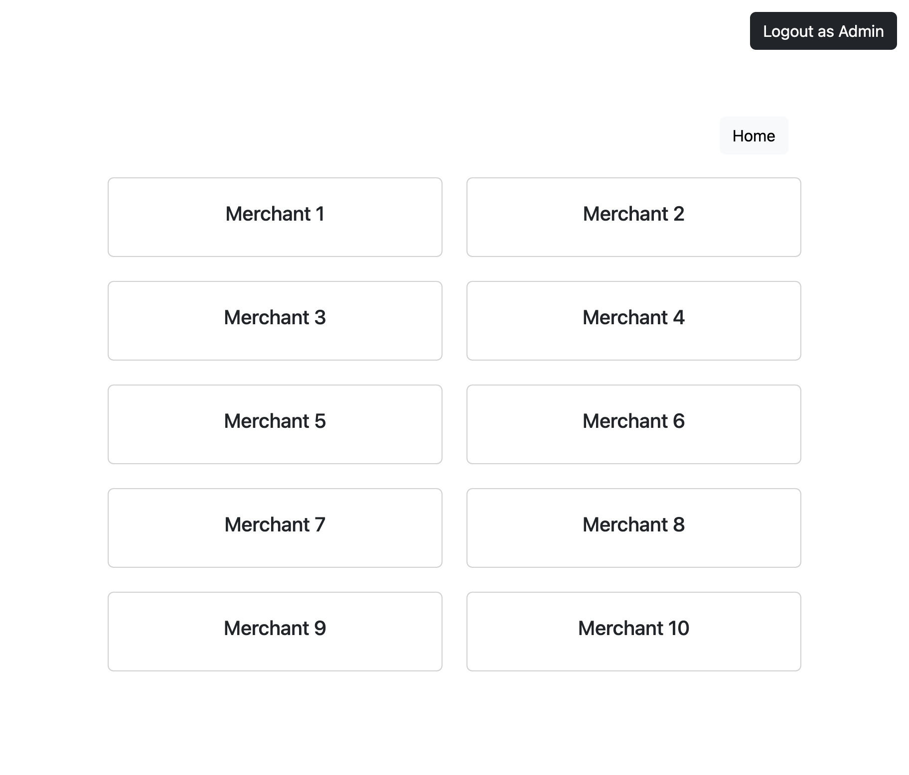
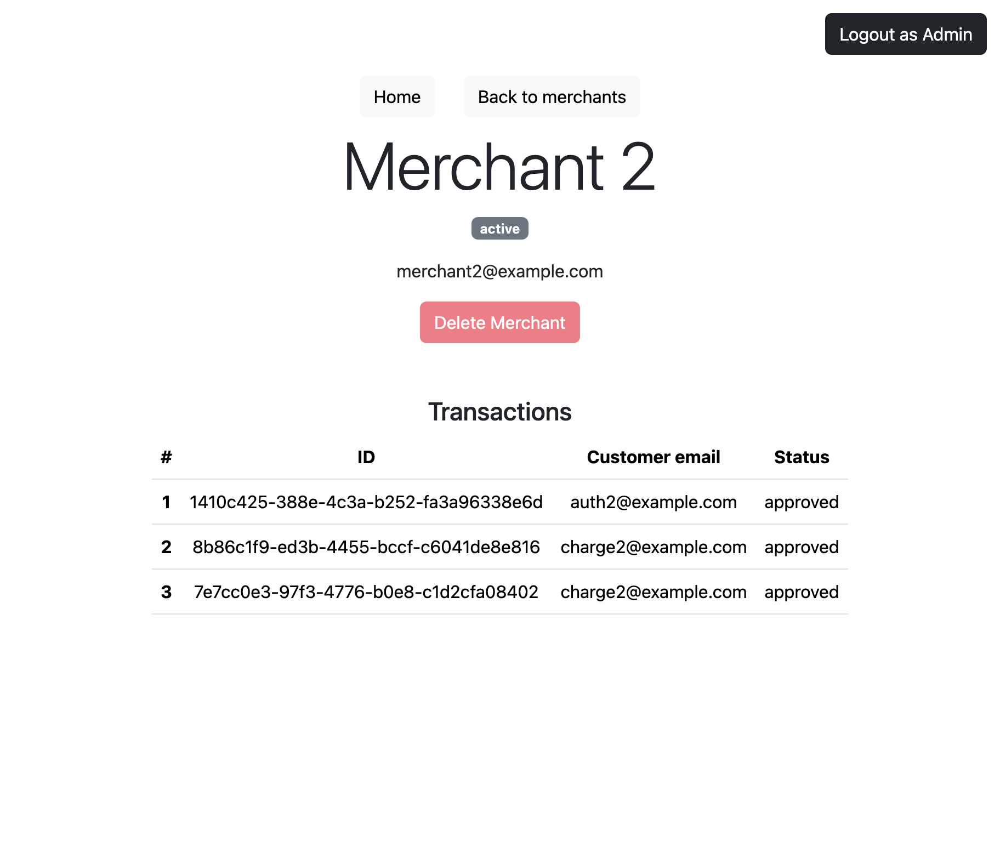

# Payment test app

## About The Project
Payment test app is a web application that leverages the power of Ruby on Rails for the backend and React for the frontend, creating a robust and dynamic platform for managing transactions and merchants. The backend is supported by a PostgreSQL database, and the application is containerized using Docker and Docker Compose for seamless deployment.

### Built With


<p float="left">
    
    
</p>

## Getting Started
### Prerequisites

- `Ruby 3.2.2`
- `Docker`

### Clone repository

```
git clone https://github.com/v7m/payment-test-app
cd payment-test-app
```

### Install dependencies

```
bundle
yarn
```

### Build Docker image

```
docker-compose build
```

### Run Docker containers 

```
bin/dev
```

### Setup database

```
docker exec -it app_container bundle exec rake db:create
docker exec -it app_container bundle exec rake db:migrate
docker exec -it app_container bundle exec rake db:seed
```

### Open application in browser

```
localhost:3000
```

### Running tests

```
docker exec -it app_container bundle exec rspec spec
```

### Code linting

```
rubocop
```


## Application Documentation

### Backend
The backend of the applications is built on the `Ruby on Rails` `v7.1.2` framework with `PostgreSQL` serving as the database.

#### Models
- `Merchant`
- `Admin`
- `Transaction`
- `Transactions::AuthorizeTransaction`
- `Transactions::ChargeTransaction`
- `Transactions::ReversalTransaction`
- `Transactions::RefundTransaction`

Transaction models implement the `STI` (Single Table Inheritance) pattern.

#### Transaction Logic
The logic for creating transactions is encapsulated in `Service Objects` and is invoked using the `Factory Pattern`.

#### Database Structure
Updating the `total_transaction_sum` field in the transactions table is achieved through triggers implemented within the database.

### Frontend
The frontend utilizes `React` for dynamic user interfaces and `Bootstrap` for styling.

#### React Components
- `App`
- `Home`
- `Merchants`
- `Merchant`
- `Transactions`

### User Interface
The user interface is designed to provide distinct views for `Merchant` (showing merchant details with associated transactions) and for `Admin` (providing a list and view for all merchants with transactions).

### JSON API
A `JSON API` is implemented using the `grape` framework along with `grape-entity` for streamlined data representation.

### Authentication and Authorization
Authentication and authorization for `Merchant` and `Admin` are handled using the `devise` gem.

### Data Import
The application supports the importing of `Merchant` and `Admin` data through `CSV` files.

### Background Jobs
Background jobs are managed using `whenever`, ensuring the smooth execution of tasks in the background.

### Testing
Unit tests are written using `rspec`, with `factory_bot_rails` and `faker` aiding in test data generation.

### Code Quality
`RuboCop` is used as a linter to maintain code quality and adherence to coding standards.